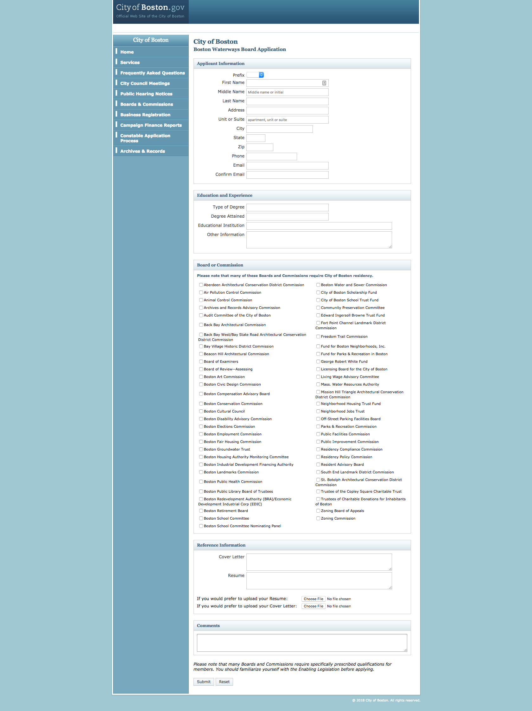

# My Awesome Project
After graduating my bootcamp with Resilient Coders, I landed a internship engineering for the City of Boston Digital Team and their goal in this application was to bring the existing cityofboston.gov boards and commissions webpage (HTML, CSS, and Javascript) onto boston.gov(React.js, Next.js). My task in this project was to improve the existing functionality and user experience for the applications form.


## How It's Made ## Lessons Learned:
In this boards and commission application form I am writing in React.js and using an NPM package called Formik.  Formik is a less painful way of making forms with event callback functions like (handleBlur, handleSubmit), setup validation, and easy error handling.

In regular React code, let’s say you have to make a input, you would have to use two-way data binding. If you want to use change/call back handler, you would have to use this.setState for your change/call back handler and wherever you would like to target exactly for the state to change and pass it to the input and every input after that.

That’s a lot of code! This becomes redundant having to setState and binding for things like handleChange, handleSubmit, handleBlur and other handlers, but Formik streamlines this process
 and does all the heavy lifting.

Being a high order component, you pass it a configuration, some props and it injects the properties into your form. It tracks all fields that have been visited, what the form’s values are, and much more. Also, they all have the same key to handle the primitives unlike regular React code.

The states are initialized by actually writing the callbacks like handleSubmit in the actual Formik code instead of writing it in the render( ) like in a normal  React Component. As shown in the code below, you would write something like this….

class Application extends Component {
componentWillMount = () => {
this.selectedCheckboxes = new Set();
}

toggleCheckbox = label => {
if (this.selectedCheckboxes.has(label)) {
 this.selectedCheckboxes.delete(label);
} else {
 this.selectedCheckboxes.add(label);
}
}

handleFormSubmit = formSubmitEvent => {
formSubmitEvent.preventDefault();

for (const checkbox of this.selectedCheckboxes) {
 console.log(checkbox, 'is selected.');
}
}
    ...but in Formik the only thing you would have to do is use a deconstructed function and add the functions like handleBlur, handleChange, and handleSubmit to pass it through certain properties. You don’t have to change the code just write the type compatible with the property. When writing in typescript, which is strict syntactical superset of JavaScript that has its own linter called TS Lint and is also designed to compile to JavaScript. Typescript An App.tsx is the file template that I had to used for my components.  Here is an example of how I would go about it in Formik:

`return (

 <div className="mn">

   <div className="b b-c">

     <SectionHeader title="Applicant Information" />

     <Formik

       initialValues={{

         firstName: '',

       }}

      onSubmit={() => {}}

       render={({

         handleSubmit,

         values,

         handleChange,

         errors,

         touched,

         handleBlur,

       }) => (

             <TextInput

                 title="First Name"

                 name="firstName"

                 placeholder="First Name"

                 value={values.firstName}

                 onChange={handleChange}

                 error={touched.firstName && errors.firstName}

                 onBlur={handleBlur}

               />)}```


   My mentor said it best in their last medium article... "I had thrown John into a type-checking world without preparation. He fell victim to a paradox of guard rails: it can take more effort to deal with a checker’s “helpful” error messages than it would ever be to debug the problems it’s warning you against."

TypeScript was giving me messages saying:
`"Type '{ name: string; placeholder: string; value: string; onChange: (e: ChangeEvent<any>) => void; erro...' is not assignable to type 'IntrinsicAttributes & IntrinsicClassAttributes<FormWithElement> & Readonly<{ children?: ReactNode...'. Type '{ name: string; placeholder: string; value: string; onChange: (e: ChangeEvent<any>) => void; erro...' is not assignable to type 'Readonly<Props>'. Property 'title' is missing in type '{ name: string; placeholder: string; value: string; onChange: (e: ChangeEvent<any>) => void; erro…'`

....I was lost but I learned from my mentor that I had to first understand what the error was trying to tell me and break it down for this case, it was saying Property 'title' is missing in type '{ name: string; placeholder: string; value: string;"" Because I had passed several props into a interface and title being one of them TypeScript picked up and thru that error to make me aware that it should be in there. Here is an example of Formik code

They even have cool props called errors and touched and used correctly when set up if a field is visited (touched) when you set up your Yup for object schema validation. It has an API that's pretty similar Joi / React PropTypes and this is a complementary package Formik) when it is blurred it will display the error you created. Here is an example of the code:

``validationSchema={Yup.object().shape({

         firstName: Yup.string()

           .required('Your First Name Is Required!')

           .min(2, 'Your First Name Needs To Be Valid'),

       })}
       ```

With firstName being the initialValue passed thru to Formik from my higher order component I created. It now knows that that TextInput.tsx is a text input field that is named “firstName” and it is a string that is required and has a minimal of 2 characters, if the field is touched ( error={touched.firstName && errors.firstName} )  then blurred ( {handleBlur} ) it will display the message created in the .min function. Or touched and there was no onChange it will let you know that it is required as well.

First, I had to pass the props to Formik in the TextInput.tsx. I thought it was simple as exporting extensions React.Component<Props> , but I also forgot I need to list the export interface so Formik knew the values of the props.


``export interface Props {

name: string;

placeholder: string;

title: string;

error?: string;

required?: boolean;

value: string;

onChange: any;

onBlur: any;

}
```

This was the tough part because I didn’t understand the errors I was receiving like “this isn’t a property for this type” and making sure all the props were lined up across the board meaning the main component, stories and the actual component instance I wrote the props in!

Going on to the next component that I which felt ten times harder than the TextInput component I created to be passed thru to the Formik function. Just like the other component I had to make sure I passed props correctly so I exported a `title:string` in the interface for that instance, I had to make sure It was in the stories

```storiesOf('CommentInput', module).add('default', () => (
  <CommentInput
    name="comments"
    placeholder="Other Comments"
    value="comments"
    onChange=""
    onBlur=""
  />
));
```
 (so you can visualize different states of your UI components and develop them interactively. Storybook is a UI development environment for your UI components.) as well as making sure your main component has all the right properties and types you wrote before.

```renderCommission(
    commission: Commission,
    checkedCommissionIds: string[],
    push,
    remove,
    handleBlur,
    commissionID
  ) {
    const checked = checkedCommissionIds.includes(commission.id.toString());

    return (
      <li
        style={{ listStyleType: 'none' }}
        key={`commissionIds.${commission.id}`}
      >
        <Checkbox
          name={`commissionIds.${commission.id}`}
          value={commission.id.toString()}
          title={commission.name}
          onChange={() => {
            if (!checked) {
              push(commission.id.toString());
            } else {
              remove(checkedCommissionIds.indexOf(commission.id.toString()));
            }
          }}
          {this.props.commissionID ===''? push(commission.id.toString():remove(checkedCommissionIds.indexOf(commission.id.toString())}
          onBlur={handleBlur}
          checked={checked}
        />
      </li>
    );
  }
```

In this renderCommission() function I had to pass in deconstructed props so you are able to use them. `Commission:Commission` is actually from a listen of boards and commission names we are fetching with Next.js to be used in this app. So for each commission map I want to map it with a checkbox but with Formik has a component that helps with common array and list manipulation and it is called FieldArray. You can also iterate through an array of objects, by following a convention of object[index]property

```<FieldArray
  name="commissionIds"
  render={({ push, remove }) => (
    <ul>
      {commissionsWithoutOpenSeats.map(commission =>
        this.renderCommission(
          commission,
          values.commissionIds,
          push,
          remove,
          handleBlur,
          commissionID
        )
      )}

      <div className="t--subinfo t--err m-t100">
        {touched.commissionIds && errors.commissionIds}
      </div>
    </ul>
  )}
/>
```
In this Formik component in the list element tag, the render method you will see that I am using the same renderCommission you see above but I mapped that with the variable I created for commissions WithoutOpen Seats, Commissions already being fetched I filtered it and used it like so there will be one set of checkboxes that will show without open seats and one with, here is a example of how i set up those variables:
``render() {
    const { commissions } = this.props;

    const commissionsWithoutOpenSeats = commissions.filter(
      commission => commission.openSeats === 0
    );
    const commissionsWithOpenSeats = commissions.filter(
      commission => commission.openSeats > 0
    );```

 The reason why push and remove methods are in that render is because   I listed that in the deconstructed function above when I stepped the onChange handle so that Formik knew that there was an onChange happening I had to pass it here as well.

 ```onChange={() => {
   if (!checked) {
     push(commission.id.toString());
   } else {
     remove(checkedCommissionIds.indexOf(commission.id.toString()));
   }
 }}
```

Because {commissions.id} is a number type I had to use the method .toString() to convert it and I had to push that to make it have the checked attribute on the checkboxes. On the else was tricky because I thought I could just remove the commission.id.toStrings but I had to use indexOf() with the commission.id.toString() to remove it. I also had to to put handleBlur so it could display the message because that wasn’t a prop that was passed thru.

## Optimizations
I have to finish this Read.me

## portfolio:

**WEBSITE:** https:/johnfleurimond.com


## Installation

1. Clone repo
2. run `yarn install`

## Usage

1. run `yarn dev`
2. Navigate to `localhost:3000/commissions/apply`
